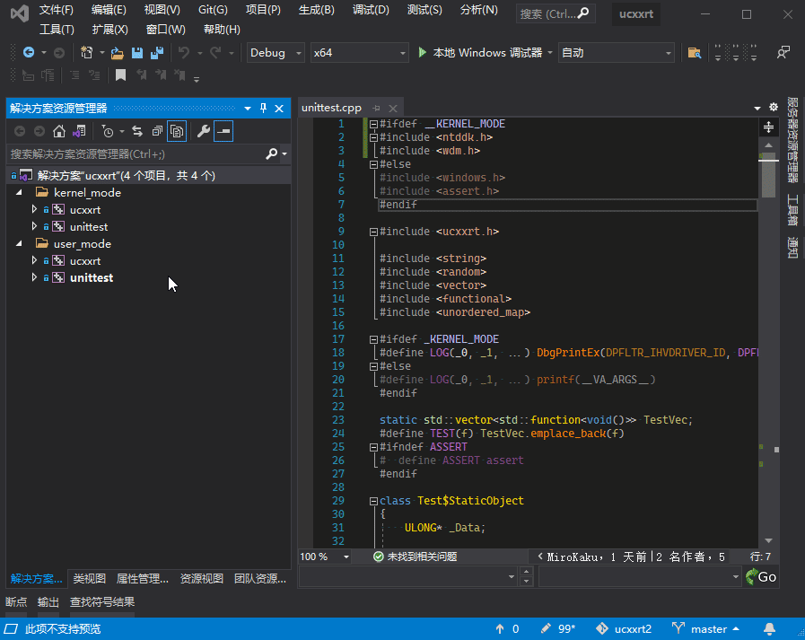

# [Universal C++ RunTime (UCXXRT)](https://github.com/mirokaku/ucxxrt) - 通用 C++ 运行时库

## 1. 关于

ucxxrt 是一个基于微软的 MSVC 修改的开源运行时库，最大的亮点就是可以在驱动中使用，使得驱动开发拥有同应用开发一样的C++体验。

在 ucxxrt 诞生之前，在驱动中使用 C++ 是由自己按需实现模板库（[KTL](https://github.com/MeeSong/KTL)、ustd、...）  
但是存在几个问题，如不支持异常。其中最主要的问题是每次新标准出来都要自己去实现一遍新特性，很浪费时间。至此，ucxxrt 就诞生了。

### 1.1 原理

* 在驱动模式下，通过属性表强行关闭内核模式标识，让编译器支持异常。同时开启异常选项 (`/EHsc`)
* 实现 `throw`、`catch` 等异常函数。在 `throw` 函数中，直接模拟分发回调到异常处理函数。

### 1.2 特性

内核模式：
- [x] 支持 new/delete
- [x] 支持 C++ 异常 (/EHsc)
- [x] 支持 SAFESEH、GS (Buffer Security Check)
- [x] 支持 STL (部分)
- [x] 支持 静态对象

[暂不支持的特性列表↓](#5-暂不支持的特性列表)

## 2. 编译

IDE：Visual Studio 2019 或更高版本

* `git clone https://github.com/MiroKaku/ucxxrt.git`
* 打开 `ucxxrt.sln` 进行编译

## 3. 怎样使用

项目中的 [unittest](https://github.com/MiroKaku/ucxxrt/blob/master/src/unittest.cpp) 可作为示例参考。

1. 将编译生成的 [`unittest`](https://github.com/MiroKaku/ucxxrt/blob/master/src/unittest.cpp) 文件夹复制到自己项目中
2. 在 Visual Studio 中，你可以打开属性管理器（视图 - 属性管理器），然后右键添加现有属性表，然后选择 `ucxxrt.props` 即可。

> 内核模式：`DriverEntry` 改为 `DriverMain`

## 4. 引用参考和感谢

* [Microsoft's C++ Standard Library](https://github.com/microsoft/stl)
* [Chuyu-Team/VC-LTL](https://github.com/Chuyu-Team/VC-LTL)
* [RetrievAL](https://github.com/SpoilerScriptsGroup/RetrievAL)

> 非常感谢这些优秀的项目，没有它们的存在，就不会有 ucxxrt。

## 5. 暂不支持的特性列表

- [ ] Thread Local Storage (TLS): thread_local、TlsAlloc ...
- [ ] std::thread
- [ ] std::filesystem
- [ ] std::chrono
- [ ] std::stacktrace_entry
- [ ] std::locale
- [ ] std::stream (std::fstream、std::iostream、std::cin、std::cout、std::cerr)
- [ ] std::mutex、std::shared_mutex
- [ ] std::future
- [ ] std::condition_variable
- [ ] std::latch
- [ ] std::semaphore (std::counting_semaphore、std::binary_semaphore)
- [ ] ...
